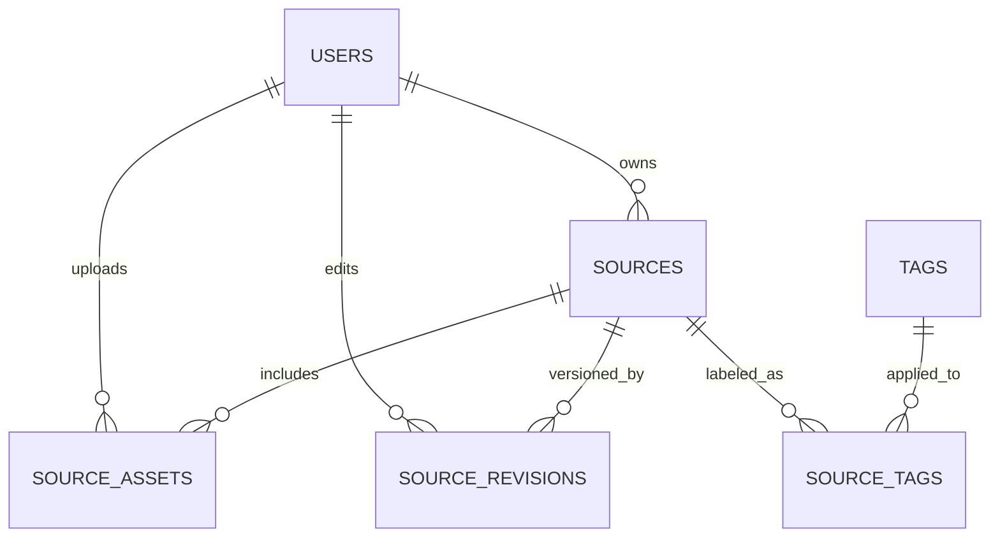

# Database Schema Blueprint

This document reflects the **simplified relational schema that is now implemented in code**. It covers user management, source content, tagging, and the basic metadata needed for draft/publish workflows. Use it as the reference when importing the SQL from `server/init.sql` or when extending the backend.

## Entity Overview

- **users** – authentication, roles (`student`, `teacher`, `admin`), status flags, and timestamps.
- **sources** – historical documents with plain text content, lifecycle status, and optional metadata (summary, location, year).
- **source_revisions** – immutable snapshots/diffs whenever source content or metadata changes.
- **source_assets** – uploaded media or linked files that enrich a source.
- **tags / source_tags** – controlled vocabulary that groups sources by topic or period.

## ER Diagram

> Tip: paste this Mermaid block into dbdiagram.io or draw.io to generate a browsable ERD.

## Attribute Highlights

| Table | Key Columns | Notes |
| ----- | ----------- | ----- |
| users | `email` (UNIQUE), `role`, `status`, `last_login` | Index on `role` or `status` helps admin dashboards. |
| sources | `owner_id`, `status`, `year`, `summary`, `text`, `content_html`, `videos_json` | `videos_json` ukládá galerii videí (ID YouTube, popisky) vykreslovanou pod textem. |
| source_revisions | `source_id`, `editor_id`, `change_type`, `snapshot_json/html` | Populate during edits to enable rollback/history views. |
| source_assets | `source_id`, `uploader_id`, `asset_type`, `asset_url`, `metadata_json` | Store absolute/relative URLs; JSON can contain dimensions, captions, checksums. |
| tags | `name`, `slug` (both UNIQUE) | Use slug for URL-friendly filters. |
| source_tags | `(source_id, tag_id)` composite PK | Pure join table; cascades with parent deletions. |

## Implementation Notes

1. **Engine & Encoding** – MySQL 8 (InnoDB, `utf8mb4`) is assumed. JSON columns are native (`JSON`); if migrating to Postgres, change to `JSONB`.
2. **Referential Integrity** – Cascading deletes keep dependent records tidy (assets, revisions, tags). Foreign keys enforce ownership consistency.
3. **Source Lifecycle** – `status` supports `draft`, `published`, `archived`. The backend auto-populates `published_at` the first time a source transitions to `published` and clears it if the status reverts.
4. **Summaries** – When users save text, the server recomputes a short summary from sanitized plain text, so annotations remain consistent without extra input.
5. **Extensibility** – Future features (e.g., questions, assignments) can be layered on via additional tables/migrations without touching the current core tables—just remember to update this document.

The SQL definition aligned with this document lives in `server/init.sql`, and the Express server ensures the same schema on startup for developer machines.
